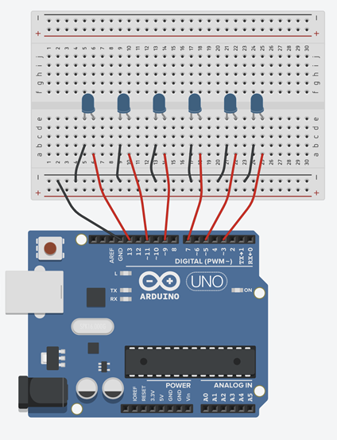

# Interactive Systems [Application] – Arduino and Prototyping | w22/23

**_Disclaimer:_** _This repo documents an Interaction Design course held at [KISD](https://kisd.de) in the winter term 2022/23. In the "sessions" section you can find supporting material to the four sessions for consolidation or rework in case of missed meetings. Please keep in mind that the transcript was not written for (scientific) completeness _and that reading without participation_ in the course is of limited value._

---

## Coding Summary of Session 1

_All Arduino Files can be found inside the [src](https://github.com/KISDinteractive/arduino_22w/tree/main/src) folder!_

**Building Blocks of Coding:**

After a short intro into Arduino, Physical Computing, Cybernetics, and System Theory (check the presentation slides for more information on these) - we started using the Arduino Uno and recapped some basic building blocks of coding and started to apply them to the Arduino ecosystem:

- Syntax & Basic Flow
- Variables
- Conditionals
- Loops
- Arrays
- Functions
- Classes, Objects, Libraries

**Basic Syntax**

```c++
// everything after a double slash is a comment, thus not interpreted as code

void setup() { … } // is executed once, when the Arduino gets power

void loop() { … } // is executed after setup() forever

{ … } // form a block: hold together functions

( … ) // parenthesis: hold parameters in order to specify functions

; // semicolon: indicates that a instruction is finished
```

**Basic Flow**


**First Examples:**

**0_serialMonitorHelloWorld**

_In order to make the Arduino say "Hello World", we establish serial communication between the Arduino and the computer through the USB cable. This will be very useful later if we want to monitor e.g. values from sensors or we want to debug our code. To initialize the serial channel, we use the command `Serial.begin(9600);` inside the setup(). After we have done that, we can send data and/or text with the `Serial.println(); `command. Text is sent with quotation marks `"..."` , while values and variables are sent without._

```c++
void setup() {
  Serial.begin(9600); //initalizing Serial Communication
}

void loop() {
  Serial.println("Hello World"); // Send the text "Hello World" to the computer in a new line
}
```

**1_blink**

_The real "Hello World" - at least in the realm of physical computing - is not so much a text output, but blinking LEDs. In order to achieve this, we connect a LED (for now, use a blue or green one) to pin 13. For that, we connect the long leg of the LED to pin 13, and the shorter leg of the led to GND, which is located directly above pin 13)._

_Since pin 0 - 13 are GPIO (=General Purpose Input/Output) -pins, we need to tell the Arduino if we are connecting an input device (sensor) or an output device (actuator) by using the `pinMode()` command inside the setup(). `pinMode()` expects two parameters. The first one is the pin number we are referring to, the second one is the mode this pin should behave (INPUT or OUTPUT)._

_Inside the loop() we use the command `digitalWrite()` (again 2 parameters, the first one refers to the pin, and the second one if it should to turned on=HIGH or off=LOW). Since we wouldn't be able to see the blinking if the LED would blink at full speed, we need to throw in a `delay()` after each change of the LED's state. The `delay()` command expects just one parameter, which is the time it should block the further execution of the code. Since the time is defined in milliseconds, we need the value 1000 to wait for a second._

```c++
void setup() {
  pinMode(13, OUTPUT);  // there is an output connected to pin 13
}

void loop() {
  digitalWrite(13, HIGH); // turn led on
  delay(1000);  // blocks futher execution for 1 second (=1000 ms)
  digitalWrite(13, LOW); // turn led of
  delay(1000); // wait again for 1 s
}
```

**2_blinkWithVariables**

_We know variables already from the [fundamentals course](https://github.com/KISDinteractive/fundamentals22w). Now we use 2 of them here to abstract the concrete number we use for specifying the `delay()` function, and the pin number we are referring to inside the `pinMode()`and the `digitalWrite()` functions. Thus, if we would change the LED pin or wanted our blinking to happen with a different speed, we need only to adjust the two values at the top and don't need to deep dive into the setup() and loop()._

```c++
int delayValue = 1000; // create a global variable of type int, named "delayValue", holding the value 1000
int ledPin = 13; // create a global variable of type int, named "ledPin", holding the value 13

void setup() {
  pinMode(ledPin, OUTPUT); //using the variable "ledPin" as first parameter of the pinMode() function
}

void loop() {
  digitalWrite(ledPin, HIGH); // using "ledPin" as input for digitalWrite()
  delay(delayValue); // using "delayValue" as input for delay()
  digitalWrite(ledPin, LOW);
  delay(delayValue);
}
```

**3_simpleSOS**

_Exercise: Use your skills to program a LED-driven, visual SOS (3x short, 3x long, 3x short)!_

_Possible Solution:_

```c++
int shortValue = 200;
int longValue = 500;
int ledPin = 13;

void setup() {
  pinMode(ledPin, OUTPUT);
}

void loop() {
  //s -----
  digitalWrite(ledPin, HIGH);
  delay(shortValue);
  digitalWrite(ledPin, LOW);
  delay(shortValue);
  digitalWrite(ledPin, HIGH);
  delay(shortValue);
  digitalWrite(ledPin, LOW);
  delay(shortValue);
  digitalWrite(ledPin, HIGH);
  delay(shortValue);
  digitalWrite(ledPin, LOW);
  delay(shortValue);

  //0 -----
  digitalWrite(ledPin, HIGH);
  delay(longValue);
  digitalWrite(ledPin, LOW);
  delay(longValue);
  digitalWrite(ledPin, HIGH);
  delay(longValue);
  digitalWrite(ledPin, LOW);
  delay(longValue);
  digitalWrite(ledPin, HIGH);
  delay(longValue);
  digitalWrite(ledPin, LOW);
  delay(longValue);

  //s -----
  digitalWrite(ledPin, HIGH);
  delay(shortValue);
  digitalWrite(ledPin, LOW);
  delay(shortValue);
  digitalWrite(ledPin, HIGH);
  delay(shortValue);
  digitalWrite(ledPin, LOW);
  delay(shortValue);
  digitalWrite(ledPin, HIGH);
  delay(shortValue);
  digitalWrite(ledPin, LOW);
  delay(shortValue);

  delay(1000);
}
```

**4_SOSwithLoops**

We can use For-Loops to summarize the 3x short, 3x long, 3x short structure and perform 3 repetitions for each. For the For-Loop you have to define 3 parameters:

1. Declare a counter-variable with a start-value: `int i = 0;`
2. Set the condition, for which, as long as it's true, the loop keeps being executed. In this case, as long as `i < 3`is true, the For-Loop goes on
3. Increment the counting variable, for this example, by 1: `i++`

So the standard For-Loop to repeat sth. 3 times is: `for(int i=0; i<3; i++) { ... }`
For our code, one intuitive way of condensing it would be:

```c++
int shortValue = 100;
int longValue = 500;
int ledPin = 13;

void setup() {
  pinMode(ledPin, OUTPUT);
}

void loop() {
  //s -----
  for ( int i= 0 ; i<3; i++) {
    digitalWrite(ledPin, HIGH);
    delay(shortValue);
    digitalWrite(ledPin, LOW);
    delay(shortValue);
  }
  //0 -----
  for ( int i= 0 ; i<3; i++) {
    digitalWrite(ledPin, HIGH);
    delay(longValue);
    digitalWrite(ledPin, LOW);
    delay(longValue);
  }
  //s -----
  for ( int i= 0 ; i<3; i++) {
    digitalWrite(ledPin, HIGH);
    delay(shortValue);
    digitalWrite(ledPin, LOW);
    delay(shortValue);
  } 
  delay(1000);
}
```

**5_SOSwithLoopsAndFunctions**

As variables can be seen as the abstraction of concrete values, functions are abstractions of behaviour. Thus, they are defined 'containers' holding sets of instructions. Functions can resolve into - or 'return', a value. In this case, they have a type that has to match the type of the return value. Functions without return values are of the type 'void'.
Also, functions can be further specified with parameters inside the parenthesizes of the function definition. If not further specified, the parenthesizes stay empty.

We can use functions to further abstract some repetitions in our SOS-Code. It is not strictly necessary, but we do it nevertheless in order to illustrate the use of functions. There are many options, but for this example, we kept it simple and created 2 void-functions (no return value) with no parameters (empty parenthesizes): -`morseS()` is holding the set of commands for the 'S', while `morseO()` is holding the instructions for the 'O'.

Now we can tidy up the loop() further. Inside the loop() we now only need to call  `morseS()`, `morseO()`, and again `morseS()` - followed by a short delay for separation - and have still the same functionality, but in a much more streamlined package, than our first SOS code found in **3_simpleSOS**

```c++
int shortValue = 200;
int longValue = 500;
int ledPin = 13;

void setup() {
  pinMode(ledPin, OUTPUT);
}

void loop() {
  morseS();
  morseO();
  morseS();
  delay(1000);
}

void morseS() {
  //s -----
  for (int i = 0; i < 3; i++) {
    digitalWrite(ledPin, HIGH);
    delay(shortValue);
    digitalWrite(ledPin, LOW);
    delay(shortValue);
  }
}

void morseO() {
  //0 -----
  for (int i = 0; i < 3; i++) {
    digitalWrite(ledPin, HIGH);
    delay(longValue);
    digitalWrite(ledPin, LOW);
    delay(longValue);
  }
}
```

**6_basicIfInput** (with Serial-Monitor)

We leave our SOS just for this example, showcasing a simple if-statement. Regarding hardware, there is a sensor connected to pin A0 and a LED connected to pin 13. In the first line of the `loop()`, we read the current state of the sensor connected to A0 with `analogRead(A0)` and save it into a newly created integer variable named 'inputValue'. After that we print 'inputValue' to the Serial Monitor with `Serial.println(inputValue)`, so we can observe the value on the screen.

Nest, we use an If-Statement to check, if the expression `(inputValue > 500)`, and with it, the state of the sensor at A0, is true or false. If 'true', the LED at pin 13 should light up, otherwise the LED should be off.

```c++
void setup() {
  Serial.begin(9600);
  pinMode(A0,INPUT); //Sensor connected to A0
  pinMode(13,OUTPUT);
}

void loop() {
  int inputValue = analogRead(A0); // read sensor value and save it into variable 'inputValue'
  Serial.println(inputValue); // print'inputValue to Serial Monitor 

  if (inputValue > 500) {
    digitalWrite(13, HIGH);
  } else {
    digitalWrite(13, LOW);
  }
  delay(10);
}
```

**7_triggerSOS**

The final form of our SOS is only sending the SOS through the LED on pin 13, if it is triggered by a sensor connected to pin A0. If the Sensor is not in a state over 500, it just waits for 1/10 second until the `loop()` ends and the sensor is checked again. It makes use of For-Loops, Functions, and the If-Statement from above.

```c++
int shortValue = 200;
int longValue = 500;
int ledPin = 13;

void setup() {
  pinMode(A0,INPUT);
  pinMode(ledPin, OUTPUT);
}

void loop() {
  int inputValue = analogRead(A0); 

  if (inputValue > 500) {
    morseS();
    morseO();
    morseS();
    delay(1000);
  } else {
    delay(100);
  }
}

void morseO() {
  //0 -----
  for (int i = 0; i < 3; i++) {
    digitalWrite(ledPin, HIGH);
    delay(longValue);
    digitalWrite(ledPin, LOW);
    delay(longValue);
  }
}
void morseS() {
  //s -----
  for (int i = 0; i < 3; i++) {
    digitalWrite(ledPin, HIGH);
    delay(shortValue);
    digitalWrite(ledPin, LOW);
    delay(shortValue);
  }
}
```

**Expaning to the Breadboard: Multiple LEDs**

Hardware:



Using a Breadboard we connect 6 LEDs as shown above. The positive poles of the LEDs (long legs) are connected to Pins 3, 5, 7, 9, 11 and 13.

After the hardware is prepared, we will look at the code for making the multiple LEDs blink one after another. For this, we will explore 3 versions of the code, from "ugly" but functional, over an intermediate solution utilizing arrays, to a more concise version using arrays and loops.

**8_uglyMultipleLEDs**

```c++
int delayValue = 100;  
int ledPin1 = 13;  
int ledPin2 = 11;
int ledPin3 = 9;
int ledPin4 = 7;
int ledPin5 = 5;
int ledPin6 = 3;

void setup() {
  pinMode(ledPin1, OUTPUT);  
  pinMode(ledPin2, OUTPUT);
  pinMode(ledPin3, OUTPUT);
  pinMode(ledPin4, OUTPUT);
  pinMode(ledPin5, OUTPUT);
  pinMode(ledPin6, OUTPUT);
}

void loop() {
  digitalWrite(ledPin1, HIGH);  
  delay(delayValue);        
  digitalWrite(ledPin1, LOW);
  delay(delayValue);

  digitalWrite(ledPin2, HIGH);  
  delay(delayValue);        
  digitalWrite(ledPin2, LOW);
  delay(delayValue);

  digitalWrite(ledPin3, HIGH);  
  delay(delayValue);        
  digitalWrite(ledPin3, LOW);
  delay(delayValue);

  digitalWrite(ledPin4, HIGH);  
  delay(delayValue);        
  digitalWrite(ledPin4, LOW);
  delay(delayValue);

  digitalWrite(ledPin5, HIGH);  
  delay(delayValue);        
  digitalWrite(ledPin5, LOW);
  delay(delayValue);

  digitalWrite(ledPin6, HIGH);  
  delay(delayValue);        
  digitalWrite(ledPin6, LOW);
  delay(delayValue);
}
```

**9_intermediateMultipleLEDs**

```c++
int delayValue = 100; 
int ledPins[] = { 13, 11, 9, 7, 5, 3 };

void setup() {
  pinMode(ledPins[0], OUTPUT);
  pinMode(ledPins[1], OUTPUT);
  pinMode(ledPins[2], OUTPUT);
  pinMode(ledPins[3], OUTPUT);
  pinMode(ledPins[4], OUTPUT);
  pinMode(ledPins[5], OUTPUT);
}

void loop() {
  digitalWrite(ledPins[0], HIGH);  
  delay(delayValue);   
  digitalWrite(ledPins[0], LOW);
  delay(delayValue);

  digitalWrite(ledPins[1], HIGH);  
  delay(delayValue);  
  digitalWrite(ledPins[1], LOW);
  delay(delayValue);

  digitalWrite(ledPins[2], HIGH);  
  delay(delayValue);  
  digitalWrite(ledPins[2], LOW);
  delay(delayValue);

  digitalWrite(ledPins[3], HIGH);  
  delay(delayValue);    
  digitalWrite(ledPins[3], LOW);
  delay(delayValue);

  digitalWrite(ledPins[4], HIGH); 
  delay(delayValue);        
  digitalWrite(ledPins[4], LOW);
  delay(delayValue);

  digitalWrite(ledPins[5], HIGH);  
  delay(delayValue);          
  digitalWrite(ledPins[5], LOW);
  delay(delayValue);
}
```

**10_niceMultipleLEDs**

```c++
int delayValue = 100;  
int ledPins[] = { 13, 11, 9, 7, 5, 3 };

void setup() {
  for (int i = 0; i < 6; i++) {
    pinMode(ledPins[i], OUTPUT);
  }
}

void loop() {
  for (int i = 0; i <= 5; i++) {
    digitalWrite(ledPins[i], HIGH);  // using "ledPin" as input for digitalWrite()
    delay(delayValue);               // using "delayValue" as input for delay()
    digitalWrite(ledPins[i], LOW);
    delay(delayValue);
  }
}
```

**11_Servo**

```c++
#include <Servo.h>

Servo myservo;  // create servo object to control a servo

int potpin = A0;  // analog pin used to connect the potentiometer
int val;    // variable to read the value from the analog pin

void setup() {
  myservo.attach(9);  // attaches the servo on pin 9 to the servo object
}

void loop() {
  val = analogRead(potpin);            // reads the value of the potentiometer (value between 0 and 1023)
  val = map(val, 0, 1023, 0, 180);     // scale it for use with the servo (value between 0 and 180)
  myservo.write(val);                  // sets the servo position according to the scaled value
  delay(15);                           // waits for the servo to get there
}
```


**12_touchInput**

```c++
#include <ADCTouch.h>

int touchOffset;  //reference values to remove offset

void setup() {
  Serial.begin(9600);
  touchOffset = ADCTouch.read(A0, 500);  //create reference values to
}

void loop() {
  int touchValue = ADCTouch.read(A0);     //read touch value
  touchValue = touchValue - touchOffset;  //remove offset
  Serial.println(touchValue);             //print to serial
  delay(100);
}
```